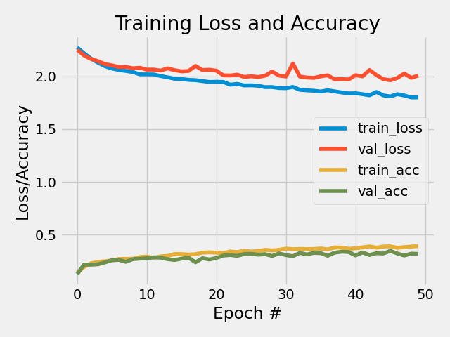

<!-- PROJECT LOGO -->
<br />
<p align="center">
  <a href="https://github.com/emiltj/cds-visual-exam">
    
  </a>
  <h3 align="center">CDS Visual Analytics exam portfolio</h3>

  <p align="center">
    Emil Trenckner Jessen
    <br />
    <a href="https://github.com/emiltj/cds-visual-exam/cds-visual-exam.pdf"><strong>Read about the project »</strong></a>
    <br />
    <a href="https://github.com/emiltj/cds-visual-exam/issues">Report Bug</a>
    ·
    <a href="https://github.com/emiltj/cds-visual-exam/issues">Request Feature</a>
  </p>
</p>

<!-- TABLE OF CONTENTS -->
<details open="open">
  <summary><h2 style="display: inline-block">Table of Contents</h2></summary>
  <ol>
    <li><a href="#about-the-project">About the project</a></li>
    <li><a href="#getting-started">Getting started</a></li>
    <li><a href="#repository-structure">Repository structure</a></li>
    <li>
      <a href="#assignments">Assignments</a>
      <ul>
        <li><a href="#assignment-2">Assignment 2</a></li>
        <li><a href="#assignment-4">Assignment 4</a></li>
        <li><a href="#assignment-5">Assignment 5</a></li>
        <li><a href="#assignment-self-assigned">Assignment self-assigned</a></li>
      </ul>
    </li>
    <li><a href="#data">Data</a></li>
    <li><a href="#license">License</a></li>
    <li><a href="#contact">Contact</a></li>
    <li><a href="#acknowledgements">Acknowledgements</a></li>
  </ol>
</details>


<!-- ABOUT THE PROJECT -->
## About the project

<p align="center"></p>

This project contains the exam portofolio coding related to the Spring 2021 module _Visual Analytics_ as part of the bachelor's tilvalg in [_Cultural Data Science_](https://bachelor.au.dk/en/supplementary-subject/culturaldatascience/) at Aarhus University. 
This README contains all the necessary information needed to get an overview of the repository, as well the installation steps required for rerunning the assignments. 

Assignments chosen for this portfolio:
* Assignment 2 - Image search 
* Assignment 4 - Logistic Regression and Neural Network benchmark mnist classification
* Assignment 5 - CNN classification of impressionist paintings
* Self-assigned - * *

<!-- GETTING STARTED -->
## Getting started

For running my scripts I'd recommend following the below steps in your bash-terminal as a setup of the virtual environment needed for all of the individual assignments.

__MAC/LINUX/WORKER02__
```bash
git clone https://github.com/emiltj/cds-visual.git
cd cds-visual
bash ./create_vis_venv.sh
```
__WINDOWS:__
```bash
git clone https://github.com/emiltj/cds-visual.git
cd cds-visual
bash ./create_vis_venv_win.sh
```

<!-- REPOSITORY STRUCTURE -->
## Repository structure

This repository has the following directory structure:

| Column | Description|
|--------|:-----------|
```data/```| Contains the data used in the assignments
```assignment_.*/``` | Contains the 4 assignments
```utils``` | Utility functions written by [Ross](https://pure.au.dk/portal/en/persons/ross-deans-kristensenmclachlan(29ad140e-0785-4e07-bdc1-8af12f15856c).html) which are utilised in some of the scripts

Furthermore it contains the files:
- ```./create_vis_venv.*.sh``` -> Bash scripts that automatically generates a new virtual environment, and install all the packages contained within ```requirements.txt```
- ```requirements.txt``` -> A list of packages along with the versions that work for the scripts
- ```README.md``` -> This very README file

<!-- ASSIGNMENTS -->
## Assignments

### Assignment 2 - Image search

### Assignment 4 - Logistic Regression and Neural Network benchmark mnist classification

### Assignment 5 - CNN classification of impressionist paintings

### Assignment self-assigned

<!-- DATA -->
## Data
flowers
cf-test
mnist

<!-- LICENSE -->
## License
Distributed under the [Apache License 2.0](https://www.apache.org/licenses/LICENSE-2.0). See ```LICENSE``` for more information.

<!-- CONTACT -->
## Contact

Feel free to write me, Emil Jessen for any questions (also regarding the reviews). 
You can do so on [Slack](https://app.slack.com/client/T01908QBS9X/D01A1LFRDE0) or on [Facebook](https://www.facebook.com/emil.t.jessen/).

<!-- ACKNOWLEDGEMENTS -->
## Acknowledgements
* [Python](https://www.rstudio.com/) - Software used for conducting the analysis
* [Ross Dean McLachlan](https://github.com/CDS-AU-DK/) - Our competent instructor for the module on Visual Analytics
