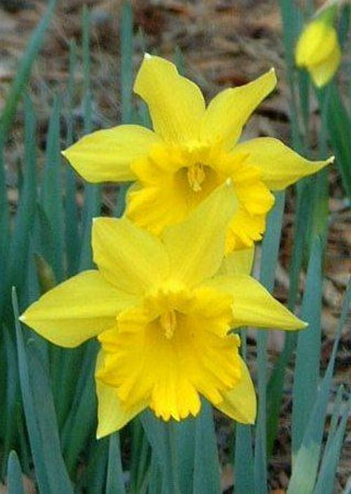
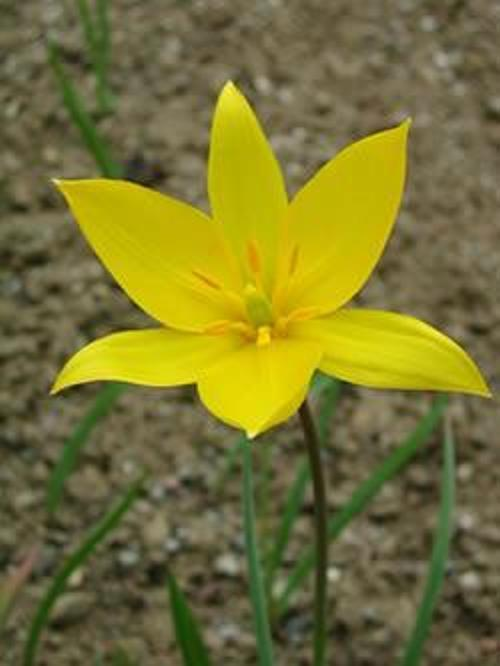

<!-- PROJECT LOGO -->
<br />
<p align="center">
  <a href="https://github.com/emiltj/cds-visual-exam">
    
  </a>
  
  <h1 align="center">Assignment 2</h1>

  <p align="center">
    Image search
    <br />
    <a href="https://github.com/emiltj/cds-visual-exam/issues">Report Bug</a>
    ·
    <a href="https://github.com/emiltj/cds-visual-exam/issues">Request Feature</a>
  </p>
</p>

<!-- TABLE OF CONTENTS -->
<details open="open">
  <summary>Table of Contents</summary>
  <ol>
    <li><a href="#assignment-description">Assignment description</a></li>
    <li><a href="#usage">Usage</a></li>
    <li><a href="#methods">Methods</a></li>
    <li><a href="#results-and-discussion">Results and discussion</a></li>
    <li><a href="#contact">Contact</a></li>
  </ol>
</details>

<!-- ASSIGNMENT DESCRIPTION -->
## Assignment description

Using the [Oxford-17](https://www.robots.ox.ac.uk/~vgg/data/flowers/17/) dataset, compare RGB-histograms of a target image and the rest of the image corpus. Utilize the chi-square method to the calculations one-by-one. Furthermore, have the script save a data frame with two column names; _filename_ and _distance_. 

- Make sure to round the number to 2 decimal places
- Also find the image with the shortest distance to target image and print it in the terminal.

<!-- USAGE -->
## Usage

Make sure to follow the instructions in the README.md located at the parent level of this repository, for the required installation of the virtual environment as well as the data download.
Subsequently, use the following code:

```bash
cd cds-visual/assignment_2
source ../cv101/bin/activate
python image_search.py
```

### Optional arguments:

image_search.py arguments for commandline to consider:
-       "-f"
        "--filepath", 
        type = str,
        default = os.path.join("data", "*.jpg"), # Default path to corpus, when none is specified
        required = False,
        help= "str - path to image corpus")
-       "-t"
        "--targetpath",
        type = str, 
        default = os.path.join("data", "image_0002.jpg"), # Default path to a target image, when none is specified
        required = False,
        help = "str - path to target file from which to calculate distance to the other images")

<!-- METHODS -->
## Methods

**Specifically for this assignment:**

For solving the project task I have made use of several functions from the cv2 library; the most important being calcHist(). It was used in this assignment for accessing information about the intensity distribution of all 3 color channels.
The histograms of non-target images and the target images were then compared using the [chi-square method](https://docs.opencv.org/3.4/d6/dc7/group__imgproc__hist.html#gga994f53817d621e2e4228fc646342d386aa88d6751fb2bb79e07aa8c8717fda881).
As a bonus, to allow for an easy inspection of the results, I included in the script the ability of saving the target image, and the image closest in distance (see images in ```out```, or in the "Results and discussion" section below).

**On a more general level (this applies to all assignments):**

I have tried to as accessible and user-friendly as possible. This has been attempted by the use of:
- Smaller functions. These are intended to solve the sub-tasks of the assignment. This is meant to improve readability of the script, as well as simplifying the use of the script.
- Information prints. Information is printed to the terminal to allow the user to know what is being processed in the background
- Argparsing. Arguments that let the user determine the behaviour and paths of the script (see "Optional arguments" section for more information)


<!-- RESULTS AND DISCUSSION -->
## Results and discussion
By running the function with the default target image we get:
<p align="center"><a href="https://github.com/emiltj/cds-visual-exam/tree/main/assignment_2/out">   </a></p>

By looking at the target image (left) and the image with the smallest histogram distance (right), we see some clear similarities in terms of color and color intensities although the plant species are not the same. The placement of the high intensities of yellow are similar, as is the ground around it, this was not a given. 
This method does not take placement of the different color intensities into account; images with high pixel intensities in the bottom left for a given color will - using this method - be as similar to an image with the same high pixel intensities in the top left for the same given color (given that all other pixels are the same for both images). If you want to find images that are similar in a way that is more in line with the human interpretation of the word "similar", you might want to consider using CNN approaches instead.


<!-- CONTACT -->
## Contact

Feel free to write me, Emil Jessen for any questions.
You can do so on [Slack](https://app.slack.com/client/T01908QBS9X/D01A1LFRDE0) or on [Facebook](https://www.facebook.com/emil.t.jessen/).
