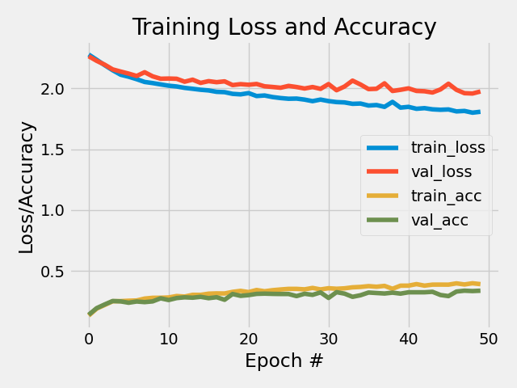
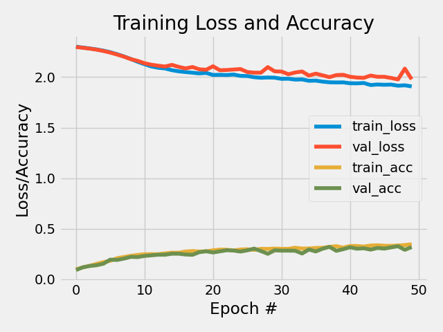

<!-- PROJECT LOGO -->
<br />
<p align="center">
  <a href="https://github.com/emiltj/cds-visual-exam">
    
  </a>
  <h2 align="center">CNN classification of impressionist paintings</h2>

  <p align="center">
    Assignment 5
    <br />
    <a href="https://github.com/emiltj/cds-visual-exam/issues">Report Bug</a>
    ·
    <a href="https://github.com/emiltj/cds-visual-exam/issues">Request Feature</a>
  </p>
</p>

<!-- TABLE OF CONTENTS -->
<details open="open">
  <summary>Table of Contents</summary>
  <ol>
    <li><a href="#assignment-description">Assignment description</a></li>
    <li><a href="#methods">Methods</a></li>
    <li><a href="#results-and-discussion">Results and discussion</a></li>
    <li><a href="#usage">Usage</a></li>
          <ul>
        <li><a href="#optional-arguments">Optional arguments</a></li>
      </ul>
    <li><a href="#contact">Contact</a></li>
  </ol>
</details>

<!-- ASSIGNMENT DESCRIPTION -->
## Assignment description

Build and train a deep neural networks classifier to classify artists of [impressionist paintings](https://www.kaggle.com/delayedkarma/impressionist-classifier-data). Can a machine-learning algorithm classify the artist of an impressionist painting? Use either the architecture _ShallowNet_ or _LeNet_.
* You should save visualizations showing loss/accuracy of the model during training
* You should also a save the output from the classification report.
* For reshaping images, I suggest checking out cv.resize() with the cv2.INTER_AREA method

<!-- METHODS -->
## Methods

**Specifically for this assignment:**

Using a compact looped structure, the paintings of the individual artists were loaded into working memory. As the CNN we use requires data in the same format, the loaded paintings were resized and converted into the right format. To improve the versatility of the script, the user is given the option of choosing between either _LeNet_ or _ShallowNet_, as well as specifying resized dimensions of the images, batch size of the script, and also number of epochs for training. Classification reports are saved to the folder ```out/```, a long with a plot showing the architecture and a plot of the training history (the relationship between training epochs and the loss/accuracy of the model.

**On a more general level (this applies to all assignments):**

I have tried to as accessible and user-friendly as possible. This has been attempted by the use of:
* Smaller functions. These are intended to solve the sub-tasks of the assignment. This is meant to improve readability of the script, as well as simplifying the use of the script.
* Information prints. Information is printed to the terminal to allow the user to know what is being processed in the background
* Argparsing. Arguments that let the user determine the behaviour and paths of the script (see <a href="#optional-arguments">"Optional arguments"</a> section for more information)


<!-- RESULTS AND DISCUSSION -->
## Results and discussion

#### Classification reports
|           | Cezanne             | Degas               | Gauguin             | Hassam             | Matisse             | Monet               | Pissarro            | Renoir              | Sargent             | VanGogh             | accuracy            | macro avg           | weighted avg        | 
|-----------|---------------------|---------------------|---------------------|--------------------|---------------------|---------------------|---------------------|---------------------|---------------------|---------------------|---------------------|---------------------|---------------------| 
| precision | 0.21  | 0.44  | 0.42 | 0.23 | 0.45 | 0.32  | 0.36  | 0.43 | 0.49 | 0.38 | 0.34 | 0.37 | 0.37 | 
| recall    | 0.43 | 0.15 | 0.37 | 0.38 | 0.20 | 0.24 | 0.45 | 0.44  | 0.31 | 0.40 | 0.34 | 0.34  | 0.34 | 
| f1-score  | 0.29 | 0.22  | 0.39 | 0.29 | 0.27  | 0.27 | 0.40 | 0.43 | 0.38 | 0.39  | 0.34 | 0.33 | 0.33 | 
| support   | 99.0                | 99.0                | 99.0                | 99.0               | 99.0                | 99.0                | 99.0                | 99.0                | 99.0                | 99.0                | 0.34 | 990.0               | 990.0               | 
<p align="center"><em>ShallowNet architecture classification report</em></p>

<br/>


|           | Cezanne             | Degas               | Gauguin             | Hassam              | Matisse             | Monet               | Pissarro            | Renoir             | Sargent             | VanGogh             | accuracy           | macro avg           | weighted avg        | 
|-----------|---------------------|---------------------|---------------------|---------------------|---------------------|---------------------|---------------------|--------------------|---------------------|---------------------|--------------------|---------------------|---------------------| 
| precision | 0.26  | 0.29 | 0.39 | 0.38 | 0.32 | 0.30   | 0.24 | 0.34            | 0.41  | 0.37  | 0.31 | 0.33 | 0.33 | 
| recall    | 0.10 | 0.26 | 0.34  | 0.17  | 0.23 | 0.42 | 0.60  | 0.33 | 0.36 | 0.35 | 0.31 | 0.31  | 0.31  | 
| f1-score  | 0.14 | 0.27  | 0.36  | 0.23 | 0.27 | 0.35 | 0.34   | 0.33 | 0.38  | 0.36  | 0.31 | 0.30  | 0.30  | 
| support   | 99.0                | 99.0                | 99.0                | 99.0                | 99.0                | 99.0                | 99.0                | 99.0               | 99.0                | 99.0                | 0.31 | 990.0               | 990.0               | 
<p align="center"><em>LeNet architecture classification report</em></p>

As can be seen in the tables (using default parameters), similar performance were found when utilizing the _LeNet_ and the _ShallowNet_ architecture, with slightly higher perfomance for the less complex architecture, _LeNet_. It achieved a macro average F1-score of .33 , compared to the score of .30 , that _ShallowNet_ achieved. Baseline accuracy for 10 classes would have been around 10%, which means an increase of about 20 percentage points compared to a model classifying randomly.
Paintings from artists such as Monet seems to be easier to classify, compared to artists such as Cezanne. High performance for Monet, may very well be due to the fact that Monet's paintings almost always depicts the same subject matter - namely French landscapes.

#### Training histories
<p align="center"><a href="https://github.com/emiltj/cds-visual-exam/blob/main/assignment_5/out/ShallowNet_training_history.png"></a>   <a href="https://github.com/emiltj/cds-visual-exam/blob/main/assignment_5/out/LeNet_training_history.png"></a></p>
<p align="center"><em>ShallowNet training history &nbsp; &nbsp; &nbsp; &nbsp; &nbsp; &nbsp; &nbsp; &nbsp; &nbsp; &nbsp; &nbsp; LeNet training history</em><p/>

**Training history of CNN following the _ShallowNet_ architecture (left):** 

We see a steady climb in training loss and training accuracy - the more epochs the better performance on the training data. However, when training any machine learning classifier, we want the model to be able to generalize to new data. That makes the validation loss and validation accuracy more interesting. When looking at accuracy, we see that the validation accuracy starts to diverge from the training accuracy at around ~5 epochs suggesting overfitting. Although additional training results in overfitting, our accuracy for the validation data set seems to be increasing slightly over epochs. Although more than 5 epochs seems to generate an overfit model, they still provide for a better generalizable model. Using regularizations methods such as LASSO, Ridge regression or a combination (ElasticNet) could perhaps have reduced the overfitting, by shrinking weights of little importance during the training. A dropout layer might also have been utilized.

**Training history of CNN following the _LeNet_ architecture (right):** 

We see a different trend when using the LeNet architecture. Given the more complex architecture of the LeNet model, we have a model that does not result in much overfitting given the first 50 epochs. Given longer training, this model may very well have begun to achieve higher F1-scores than the other model. Given any future use, this would be recommended.

<!-- USAGE -->
## Usage

Make sure to follow the instructions in the README.md located at the parent level of this repository, for the required installation of the virtual environment as well as the data download.

Subsequently, use the following code (when within the ```cds-visual-exam``` folder):

```bash
cd assignment_5
source ../cv101/bin/activate # If not already activated
python cnn-artists.py
```

### Optional arguments:

cnn-artists.py arguments for commandline to consider:
-       "--cnn", 
        type = str,
        default = "ShallowNet",
        required = False,
        help = "str - specifying cnn architecture, use either \"ShallowNet\" or \"LeNet\"")
-       "--resizedim",
        type = list, 
        default = [32, 32],
        required = False,
        help = "list - specifying dimensions that the pictures should be resized to, e.g. [32, 32]")
-       "--batch_size",
        type = int, 
        default = 200,
        required = False,
        help = "int - specifying batch size")
-       "--epochs",
        type = int, 
        default = 50,
        required = False,
        help = "int - specifying number of epochs")

<!-- CONTACT -->
## Contact

Feel free to write me, Emil Jessen for any questions.
You can do so on [Slack](https://app.slack.com/client/T01908QBS9X/D01A1LFRDE0) or on [Facebook](https://www.facebook.com/emil.t.jessen/).
