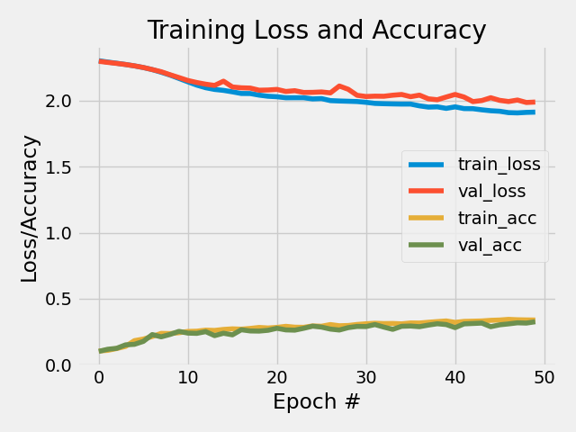

<!-- PROJECT LOGO -->
<br />
<p align="center">
  <a href="https://github.com/emiltj/cds-visual-exam">
    
  </a>
  <h1 align="center">Assignment 5</h1>

  <p align="center">
    CNN classification of impressionist paintings
    <br />
    <a href="https://github.com/emiltj/cds-visual-exam/issues">Report Bug</a>
    ·
    <a href="https://github.com/emiltj/cds-visual-exam/issues">Request Feature</a>
  </p>
</p>

<!-- TABLE OF CONTENTS -->
<details open="open">
  <summary>Table of Contents</summary>
  <ol>
    <li><a href="#assignment-description">Assignment description</a></li>
    <li><a href="#usage">Usage</a></li>
    <li><a href="#methods">Methods</a></li>
    <li><a href="#results-and-discussion">Results and discussion</a></li>
    <li><a href="#contact">Contact</a></li>
  </ol>
</details>

<!-- ASSIGNMENT DESCRIPTION -->
## Assignment description

Build and train a deep neural networks classifier to classify artists of [impressionist paintings](https://www.kaggle.com/delayedkarma/impressionist-classifier-data). Can a machine-learning algorithm classify the artist of an impressionist painting? Use either the architecture _ShallowNet_ or _LeNet_.
You should save visualizations showing loss/accuracy of the model during training; you should also a save the output from the classification report.


<!-- USAGE -->
## Usage

Make sure to follow the instructions in the README.md located at the parent level of this repository, for the required installation of the virtual environment as well as the data download.
Subsequently, use the following code:

```bash
cd cds-visual/assignment_2
source ../cv101/bin/activate
python cnn-artists.py
```

### Optional arguments:

cnn-artists.py arguments for commandline to consider:
-       "--cnn", 
        type = str,
        default = "ShallowNet",
        required = False,
        help = "str - specifying cnn architecture, use either \"ShallowNet\" or \"LeNet\"")
-       "--resizedim",
        type = list, 
        default = [32, 32],
        required = False,
        help = "list - specifying dimensions that the pictures should be resized to, e.g. [32, 32]")
-       "--batch_size",
        type = int, 
        default = 200,
        required = False,
        help = "int - specifying batch size")
-       "--epochs",
        type = int, 
        default = 50,
        required = False,
        help = "int - specifying number of epochs")

<!-- METHODS -->
## Methods

**Specifically for this assignment:**

Using a compact looped structure, the paintings of the individual artists were loaded into working memory. As the CNN we use requires data in the same format, the loaded paintings were resized and converted into the right format. To improve the versatility of the script, the user is given the option of choosing between either _LeNet_ or _ShallowNet_, as well as specifying resized dimensions of the images, batch size of the script, and also number of epochs for training. Classification reports are saved to the folder ```out/```, a long with a plot showing the architecture and a plot of the training history (the relationship between training epochs and the loss/accuracy of the model.

**On a more general level (this applies to all assignments):**

I have tried to as accessible and user-friendly as possible. This has been attempted by the use of:
- Smaller functions. These are intended to solve the sub-tasks of the assignment. This is meant to improve readability of the script, as well as simplifying the use of the script.
- Information prints. Information is printed to the terminal to allow the user to know what is being processed in the background
- Argparsing. Arguments that let the user determine the behaviour and paths of the script (see "Optional arguments" section for more information)


<!-- RESULTS AND DISCUSSION -->
## Results and discussion
**_ShallowNet_ architecture classification report**
|           | Cezanne             | Degas               | Gauguin             | Hassam             | Matisse             | Monet               | Pissarro            | Renoir              | Sargent             | VanGogh             | accuracy            | macro avg           | weighted avg        | 
|-----------|---------------------|---------------------|---------------------|--------------------|---------------------|---------------------|---------------------|---------------------|---------------------|---------------------|---------------------|---------------------|---------------------| 
| precision | 0.21  | 0.44  | 0.42 | 0.23 | 0.45 | 0.32  | 0.36  | 0.43 | 0.49 | 0.38 | 0.34 | 0.37 | 0.37 | 
| recall    | 0.43 | 0.15 | 0.37 | 0.38 | 0.20 | 0.24 | 0.45 | 0.44  | 0.31 | 0.40 | 0.34 | 0.34  | 0.34 | 
| f1-score  | 0.29 | 0.22  | 0.39 | 0.29 | 0.27  | 0.27 | 0.40 | 0.43 | 0.38 | 0.39  | 0.34 | 0.33 | 0.33 | 
| support   | 99.0                | 99.0                | 99.0                | 99.0               | 99.0                | 99.0                | 99.0                | 99.0                | 99.0                | 99.0                | 0.34 | 990.0               | 990.0               | 

**_LeNet_ architecture classification report**
|           | Cezanne             | Degas               | Gauguin             | Hassam              | Matisse             | Monet               | Pissarro            | Renoir             | Sargent             | VanGogh             | accuracy           | macro avg           | weighted avg        | 
|-----------|---------------------|---------------------|---------------------|---------------------|---------------------|---------------------|---------------------|--------------------|---------------------|---------------------|--------------------|---------------------|---------------------| 
| precision | 0.26  | 0.29 | 0.39 | 0.38 | 0.32 | 0.30   | 0.24 | 0.34            | 0.41  | 0.37  | 0.31 | 0.33 | 0.33 | 
| recall    | 0.10 | 0.26 | 0.34  | 0.17  | 0.23 | 0.42 | 0.60  | 0.33 | 0.36 | 0.35 | 0.31 | 0.31  | 0.31  | 
| f1-score  | 0.14 | 0.27  | 0.36  | 0.23 | 0.27 | 0.35 | 0.34   | 0.33 | 0.38  | 0.36  | 0.31 | 0.30  | 0.30  | 
| support   | 99.0                | 99.0                | 99.0                | 99.0                | 99.0                | 99.0                | 99.0                | 99.0               | 99.0                | 99.0                | 0.31 | 990.0               | 990.0               | 

As can be seen in the tables (using default parameters), similar performance were found when utilizing the _LeNet_ and the _ShallowNet_ architecture, with slightly higher perfomance for the more complex architecture, _LeNet_. It achieved a macro average F1-score of _ , compared to the score of _ , that _ShallowNet_ achieved. When taking into account the fact that there are 10 artists and that each artist may paint various different portraits, these scores are relatively high.

Paintings from artists such as Monet seems to be easier to classify, compared to artists such as Cezanne. High performance for Monet, may very well be due to the fact that Monet's paintings almost always depicts the same subject matter - namely French landscapes. 

<p align="center"><a href="https://github.com/emiltj/cds-visual-exam/tree/main/assignment_4/out">   </a></p>
<p align="center"><em>ShallowNet training history &nbsp; &nbsp; &nbsp; &nbsp; &nbsp; &nbsp; &nbsp; &nbsp; &nbsp; &nbsp; &nbsp; LeNet training history</em><p/>

When looking at the training histories of the CNN following the _ShallowNet_ architecture ...

When looking at the training histories of the CNN following the _LeNet_ architecture


<!-- CONTACT -->
## Contact

Feel free to write me, Emil Jessen for any questions.
You can do so on [Slack](https://app.slack.com/client/T01908QBS9X/D01A1LFRDE0) or on [Facebook](https://www.facebook.com/emil.t.jessen/).
