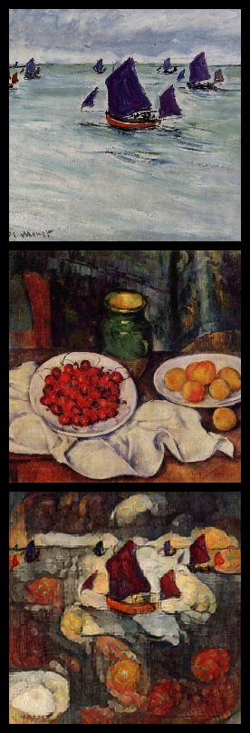
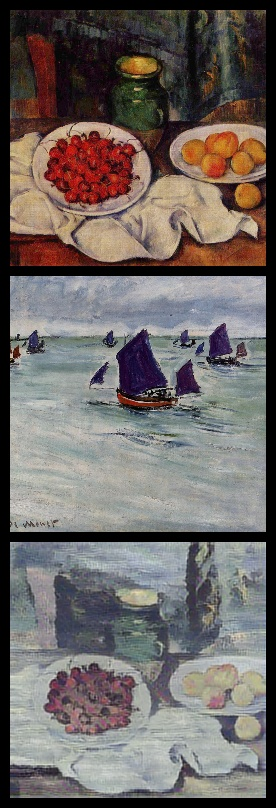

<!-- PROJECT LOGO -->
<br />
<p align="center">
  <a href="https://github.com/emiltj/cds-visual-exam">
    
  </a>
  <h1 align="center">????</h1>

  <p align="center">
    ??????
    <br />
    <a href="https://github.com/emiltj/cds-visual-exam/issues">Report Bug</a>
    ·
    <a href="https://github.com/emiltj/cds-visual-exam/issues">Request Feature</a>
  </p>
</p>

<!-- TABLE OF CONTENTS -->
<details open="open">
  <summary>Table of Contents</summary>
  <ol>
    <li><a href="#assignment-description">Assignment description</a></li>
    <li><a href="#usage">Usage</a></li>
    <li><a href="#methods">Methods</a></li>
    <li><a href="#results-and-discussion">Results and discussion</a></li>
    <li><a href="#contact">Contact</a></li>
  </ol>
</details>

<!-- ASSIGNMENT DESCRIPTION -->
## Assignment description

This self-assigned assignment has two main questions it seeks to investigate. The investigation is not hypothesis driven nor research oriented. Rather, it is meant to be a fun and atypical way of exploring some methods used in visual analytics.

**Question 1 - Generating stylized paintings**

_Is it possible to use the method of style transfer to stylize paintings of one artist with the style of another?_ 
This assignment seeks to investigate the possibility of not just transferring style from a painting to an actual image, but to transfer the style of a painting to another painting. Using paintings from the artists _Cezanne_ and _Monet_ using the [impressionist paintings dataset](https://www.kaggle.com/delayedkarma/impressionist-classifier-data), create a script which generates new stylized images (contents of Cezanne with styles of Monet and vice versa).
- Save the stylized images in unique folders with names specifying the stylized images.
- Save images that provide an example of the stylized images. Show a content image, a style image, and the resulting stylized image.

**Question 2 - Classification of stylized images**

_When CNN's classify paintings from artists, do they rely on the style of a given image? Or rather more on the content of the image?_ This part of the assignment seeks to investigate the importance of content vs. style when classifying images. Style transfer refers to the act of minimizing the loss of information between two sets of embedded images. One image (the style image) is embedded using the first few layers of a neural network and network activations are sampled from this embedded image. The other image (the content image) is embedded using the same neural network, but using the first <ins>many</ins> layers of the network. Likewise, the embedded image from this layer is also extracted. Using these two embeddings, style transfer then seeks to synthesize the two with regards to a loss function that minimizes the information loss of both images.


<!-- USAGE -->
## Usage

Make sure to follow the instructions in the README.md located at the parent level of this repository, for the required installation of the virtual environment as well as the data download.
Subsequently, use the following code:

```bash
cd cds-visual/assignment_2
source ../cv101/bin/activate
python cnn-artists.py
```

### Optional arguments:
s
.py arguments for commandline to consider:
-       s
-       
.py arguments for commandline to consider:
-       

<!-- METHODS -->
## Methods

**Specifically for this assignment:**

For generating stylized images,

https://en.wikipedia.org/wiki/Neural_Style_Transfer#Formulation


**On a more general level (this applies to all assignments):**

I have tried to as accessible and user-friendly as possible. This has been attempted by the use of:
- Smaller functions. These are intended to solve the sub-tasks of the assignment. This is meant to improve readability of the script, as well as simplifying the use of the script.
- Information prints. Information is printed to the terminal to allow the user to know what is being processed in the background
- Argparsing. Arguments that let the user determine the behaviour and paths of the script (see "Optional arguments" section for more information)


<!-- RESULTS AND DISCUSSION -->
## Results and discussion

#### Generating stylized paintings:
<p align="center">
<em>
Top: Content
<br/>
Middle: Style
<br/>
Bottom: Stylized image
</em>
<br/>
</p>
<p align="center"><a href="https://github.com/emiltj/cds-visual-exam/blob/main/assignment_self/out/example_7.jpg"></a>&nbsp; &nbsp; &nbsp; &nbsp;<a href="https://github.com/emiltj/cds-visual-exam/blob/main/assignment_self/out/example_17.jpg"></a></p>
<p align="center"><em>Content: Monet, style: Cezanne  &nbsp; &nbsp; &nbsp; &nbsp; &nbsp; &nbsp; &nbsp; &nbsp; &nbsp; &nbsp; Content: Gauguin, style: Cezanne</em><p/>

When looking at the above two images and ([the rest of the examples](https://github.com/emiltj/cds-visual-exam/tree/main/assignment_self/out)), it does indeed seem possible to transfer style from a painting, to another painting. However, from a brief glance at the 20 examples it seems that when using portraits of people as style image, the process seems to generate paintings that are hard to interpret (e.g. [image 12](https://github.com/emiltj/cds-visual-exam/blob/main/assignment_self/out/example_12.jpg).

Alternatively to the random pairings of style/content images, one could have considered extracting the styles of all images of one artist and then subsequently found the weights resulting in the least information loss across all these images. This way we would have the general style of an artist to use as the style image when stylizing images. However, a caveat to this method would be the artist we have here, tend to not have the same style of painting over time. The fact that the noise from the content that is inevitably fed into the style imbedding would also require an enormous number of paintings from each artist.

#### Classification of stylized images


<!-- CONTACT -->
## Contact

Feel free to write me, Emil Jessen for any questions.
You can do so on [Slack](https://app.slack.com/client/T01908QBS9X/D01A1LFRDE0) or on [Facebook](https://www.facebook.com/emil.t.jessen/).
